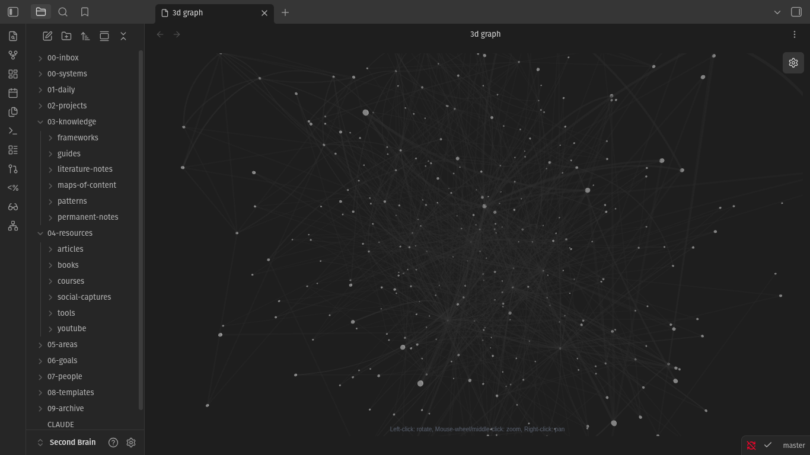
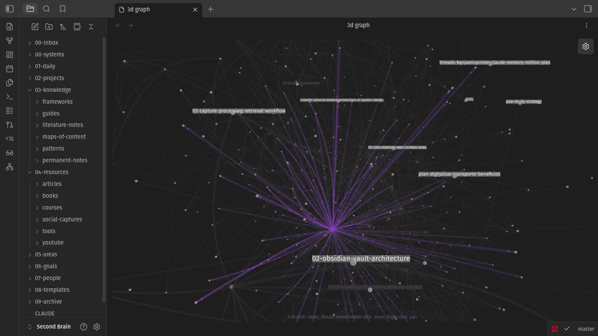

# CKIS — Central Knowledge & Intelligence System

> A developer knowledge operating system that compounds over time.
> Obsidian + Claude Code + Git — your second brain, built for engineers.

[](LICENSE)
[](https://github.com/aedneth/ckis/generate)
[](https://claude.ai/code)
[](CHANGELOG.md)

---

<div align="center">

**Before CKIS** — knowledge isolated in inbox, no connections, cold sessions every day



**After CKIS** — every note connects, every session starts with full context, knowledge compounds



*The 3D graph view (Open 3D Graph plugin) shows the health of your knowledge system at a glance.*
*Purple = cross-project connections. Central nodes = your most-linked ideas.*

</div>

---

## The Problem

Every Claude Code session starts cold. You re-explain your projects. Decisions evaporate. Insights from last week are unreachable. Your AI assistant is brilliant in the moment but amnesiac across sessions.

Sound familiar? In 2026, a Notion vault with 822 files was audited — 90% were empty template shells. Two purchased templates stitched together, zero cross-system relations, six separate goal-tracking databases. Professionally organized, operationally unsustainable. The architecture looked good. The maintenance cost was crushing.

**The failure mode is not the tool. It's the manual organization layer.**

## The Solution

CKIS is a structured Obsidian vault + Claude Code skill system that eliminates the manual organization layer:

- **Injects full context automatically** at every session start — project state, recent decisions, code architecture
- **Compounds knowledge** across sessions — every conversation builds on the last
- **Bridges code ↔ knowledge** — your codebases are queryable knowledge graphs, not just files
- **Runs itself** — 5 crons handle weekly reviews, memory consolidation, vault git sync, and more

You stop managing your second brain. It manages itself.

---

## Quick Start

**Works on any OS with Obsidian + Claude Code installed.**

```bash
# 1. Clone this template (or click "Use this template" above)
gh repo create my-second-brain --template aedneth/ckis --private --clone
cd my-second-brain

# 2. Open the vault in Obsidian
# File → Open Vault → select this folder

# 3. Install community plugins (Settings → Community plugins → Browse)
# Essential: Obsidian Git, Templater, Dataview, Periodic Notes, Calendar

# 4. Open Claude Code in this directory
claude

# 5. Say "daily brief" — Claude now has full context and generates your first morning brief
```

**That's it.** Claude reads your vault structure, understands your system, and starts compounding knowledge immediately.

---

## Architecture

CKIS is a three-layer memory system:

```
┌─────────────────────────────────────────────────┐
│  Layer 3: CKIS Vault (Strategic Memory)         │
│  Obsidian + Claude Code + Git                   │
│  → Notes, decisions, goals, relationships       │
│  → Updated via 20+ skills + 5 crons             │
├─────────────────────────────────────────────────┤
│  Layer 2: Dev Brain (Engineering Memory)        │
│  ~/Documents/Dev Brain/ — auto-indexed          │
│  → Code knowledge graphs (graphify)             │
│  → Session history + wiki digest per project    │
├─────────────────────────────────────────────────┤
│  Layer 1: .brain/ (Session Memory)              │
│  Per-project, regenerated on every commit       │
│  → Working context for the current session      │
└─────────────────────────────────────────────────┘
```

Each layer is automatically populated. You never manually maintain the Dev Brain or .brain/ — git hooks and crons do it.

### Vault structure

```
00-inbox/          # Everything enters here first (quick-capture, url-dumps, queues)
00-systems/        # CKIS architecture (22 docs) + workflows
01-daily/          # Daily notes + session logs
02-projects/       # Active projects (one folder each, with _overview.md)
03-knowledge/      # Processed knowledge (permanent-notes, MOCs, frameworks, guides, patterns)
04-resources/      # Source material (articles, books, youtube, social-captures, tools)
05-areas/          # Life areas (personal-brand, finance, health, learning, relationships)
06-goals/          # Unified goal system (annual → quarterly → monthly → weekly)
07-people/         # Relationship intelligence (clients, mentors, network)
08-templates/      # Note templates for every type
09-archive/        # Completed or inactive items
.claude/           # Claude Code config + 25 skills
```

---

## The Skill System

CKIS ships with **25 Claude Code skills** — natural language triggers that execute vault operations.

### Daily rhythm

| Trigger | What it does |
|---|---|
| `daily brief` | Morning priorities + project pulse + inbox status |
| `braindump` | Capture raw thoughts → classified + filed automatically |
| `process inbox` | Route inbox items to correct folders with frontmatter |
| `project context [name]` | Full project brief in 60 seconds — status, blockers, recent sessions |

### Processing

| Trigger | What it does |
|---|---|
| `process URL [url]` | Extract + summarize any web page → vault note |
| `process YouTube [url]` | Transcript → key points → literature note |
| `process social` | Social media captures → processed literature notes |
| `convert files` | Convert .docx, .pdf, images → clean markdown |
| `synthesize [topic]` | Find all vault notes on a topic → synthesized permanent note |

### Review & planning

| Trigger | What it does |
|---|---|
| `weekly review` | Scan week → goal check → patterns → next week's focus |
| `knowledge consolidation` | Monthly pattern detection → update MOCs → intelligence report |
| `log decision [title]` | Structured decision log → routed to correct file |

### Cross-model & maintenance

| Trigger | What it does |
|---|---|
| `export context` | Package vault state for ChatGPT upload |
| `cross-model handoff` | Pass session context between Claude and ChatGPT |
| `ckis vault maintenance` | Health checks across all 22 architecture files |

**Full skill reference:** `00-systems/ckis/20-ckis-skills-usage-guide.md`

---

## Visualizing Your Knowledge

Install the **3D Graph** community plugin (Open 3D Graph by Alexander Weichart) to see your vault as a navigable knowledge network.

Recommended settings: nodes sized by backlinks, colored by folder, force decay 0.4. The graph is a **diagnostic** — dispersed nodes mean unprocessed inbox; dense clusters mean compounding knowledge.

**Full guide:** `00-systems/ckis/21-obsidian-3d-graph-guide.md`

---

## Agent Habits — Getting the Most from AI Sessions

The 5 habits that make the difference between a cold-start assistant and a compounding knowledge agent:

1. **Session start** — always say `daily brief` or `project context [name]` before coding
2. **Capture during** — dump anything interesting to `00-inbox/quick-capture/`
3. **Session end** — log what was built and decided
4. **Weekly** — run `weekly review` every Sunday (or let Cron 4 do it Friday at 17:00)
5. **Monthly** — run `knowledge consolidation` to detect patterns

**Full guide:** `00-systems/ckis/19-agent-habits-guide.md`

---

## Automated Crons

CKIS runs 5 crons that maintain the system without manual effort:

| Cron | Schedule | What it does |
|---|---|---|
| Cron 1: Vault git sync | Every 6h | `git add . && git commit && push` |
| Cron 2: CRM sort | Daily 07:30 | Sort and de-duplicate inbox items |
| Cron 3: Content discovery | Configurable | Surface new content to process |
| Cron 4: Weekly review | Fri 17:00 | Auto-runs `ckis-weekly-review` skill |
| Cron 5: Memory consolidation | 1st of month | Rewrites `_MEMORY.md` from vault state |

**Setup guide:** `00-systems/ckis/17-crons-architecture.md`

---

## From Execution Plan to Agentic OS — The Evolution

CKIS v1.0 (April 2026) started as a simple answer to one question: *how do you stop a second brain from becoming 822 empty files?*

The answer was radical simplicity: Obsidian = storage layer, Claude Code = intelligence layer. One folder structure. One set of skills. One processing rule (everything enters `00-inbox/` first). No manual organization.

From that foundation, CKIS evolved through compounding insight:

- **v1.0** — Vault structure + CLAUDE.md + 10 basic skills
- **v2.0** — Per-project `.brain/` layer + graphify code indexing + git hooks
- **v2.1** — Dev Brain autonomous pipeline (sessions/index.md, wiki digest, query-all.sh)
- **v2.2** — 5 crons + multi-agent architecture (Opus orchestrator) + full skill audit
- **v2.3** — Complete folder structure, 3D graph guide, Apache 2.0, agentmemory evaluation

The vision was always an Agentic OS: a system that manages itself while you focus on building. Each version moved further from "tool you maintain" toward "system that compounds autonomously."

**Full architecture:** `00-systems/ckis/00-ckis-master-context.md`

---

## Recommended Plugin Stack

### Day 1 (essential)

| Plugin | Purpose |
|---|---|
| Obsidian Git | Auto-commit version control |
| Templater | Dynamic note templates |
| Dataview | Query your vault like a database |
| Calendar | Daily notes navigation |
| Periodic Notes | Auto weekly/monthly note creation |
| 3D Graph (Open 3D Graph) | Visualize knowledge connections |

### Week 2+ (recommended)

| Plugin | Purpose |
|---|---|
| Copilot | Chat with your vault |
| Smart Connections | AI-powered note linking |
| Omnisearch | Full-text vault search |
| Excalidraw | Visual thinking and diagrams |

---

## Related Tools

| Tool | Relationship |
|---|---|
| [agentmemory](https://github.com/rohitg00/agentmemory) | Reactive auto-capture memory for AI agents. Complementary: agentmemory captures automatically from every tool call; CKIS captures deliberately via skills and crons. Evaluation in `00-systems/ckis/22-optional-agentmemory-integration.md`. |
| [graphify](https://github.com/aedneth/graphify) | Code knowledge graph engine powering the Dev Brain layer (Layer 2). Required for the per-project second brain architecture. |
| [Obsidian](https://obsidian.md) | The storage and visualization layer. CKIS is built on top of Obsidian, not a replacement. |

---

## Contributing

CKIS is an open template — adapting it to your workflow is the point. Contributions to the architecture, skills, and guides are welcome.

See [CONTRIBUTING.md](CONTRIBUTING.md) for guidelines. For bugs: [open an issue](https://github.com/aedneth/ckis/issues). For architecture discussions: [start a discussion](https://github.com/aedneth/ckis/discussions).

---

## License

Apache 2.0 — use freely, fork freely, build on it commercially. Attribution required. See [LICENSE](LICENSE).

---

Built by the CKIS community. Original author: [@aedneth](https://github.com/aedneth).
